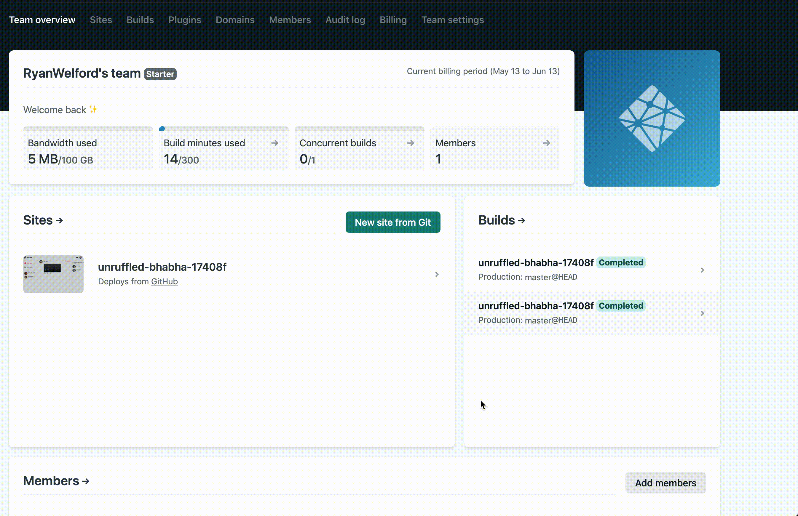

***REMOVED***
***REMOVED***

***REMOVED***
***REMOVED***
***REMOVED***

*50 minutes, Intermediate, [Start Building](#running-astra-tik-tok)*

A simple Netflix clone running on AstraDB that leverages the GraphQL API.
***REMOVED***

***REMOVED***

## Objectives
* Deploy a Netflix clone "locally" and to production
* Learn how to use the @astrajs GraphQL API to retrieve pre-populated data
***REMOVED***

***REMOVED***

***REMOVED***
***REMOVED*** 
***REMOVED***
***REMOVED***
***REMOVED***
***REMOVED***
***REMOVED*** You will have to adapt commands and paths based on your environment and install the dependencies by yourself. **We won't provide support** to keep on track with schedule. However, we will do our best to give you the info you need to be successful.

***REMOVED***
***REMOVED*** * You will need a github account
***REMOVED*** * You will also need Netlify and Astra accounts, but we'll work through that in the exercises
***REMOVED*** * Use **Chrome** or **Firefox** for the best experience. Other browsers are great, but don't work well with the GitPod integration we use a bit later.

***REMOVED***
***REMOVED*** * No. All tools and services we provide here are FREE.

***REMOVED***

***REMOVED***

***REMOVED***(EDIT)
***REMOVED***
***REMOVED***

***REMOVED*** (EDIT)

<img src="tutorial/images/tiktok-badge.png?raw=true" width="200" align="right" /***REMOVED***

***REMOVED***

***REMOVED*** Make screenshots alongside the steps and show us your deployed production TikTok clone up in Netlify.
2. (Optional extra credit) Watch the 2 hour Ania video [HERE](#video-tutorial-with-ania-kubow), build the app yourself, and show us the completed app.
3. Submit your homework [here](https://github.com/datastaxdevs/workshop-astra-tik-tok/issues/new?assignees=HadesArchitect&labels=homework%2Cpending&template=homework-assignment.md&title=%5BHW%5D+%3CNAME%3E)

***REMOVED***
  
***REMOVED***

***REMOVED***

##***REMOVED***
1. [Create AstraDB Instance](#2-create-astra-instance)
2. [Create a security token](#3-create-a-security-token)
3. [Create table **genre** with GraphQL](#4-create-table-genre-with-graphql)
4. [Insert data in **genre**  with GraphQL](#5-insert-data-in-the-table-with-graphql)
5. [Retrieve values of **genre** table](#6-retrieving-list-of-values)
6. [Create **movie** table](#7-creating-a-movies-table)
7. [Insert values in **movie** table](#8-insert-values-in-movie-table)
8. [Retrieve values from **movie** table](#9-retrieve-values-from-movie-tables)

###  Part 2 - Deploy to Production
1. [Deploy to Netlify](#2-deploy-to-netlify)
2. [Clone your GitHub repository](#3-clone-your-github-repository)
3. [Launch GitPod](#4-launch-gitpod-ide)
4. [Install the Netlify CLI](#5-install-the-netlify-cli-command-line-interface)
5. [Retrieve application token to securely connect to the database](#6-generate-application-token-to-securely-connect-to-the-database)
6. [Configure Environment Variables and Install Dependencies](#7-configure-and-connect-database)
7. [Launch your app](#8-launch-your-app)
8. [Connect Netlify to your site](#9-connect-netlify-to-your-site)
9. [Deploy to production](#10-deploy-to-production)

### Part 3 - Working with AstraDB and the GraphQL API
11. [Connecting the Database](#11-connecting-the-database)

***REMOVED***
***REMOVED***

***REMOVED***

***REMOVED***

***REMOVED***

***REMOVED*** *When creating your instance use the promotion code **ANIA200** to get 200$ of free credit allowing you about 30 million writes + 30 Million reads  + 50GB a month of monthly storage!!*

**`ASTRA`** is the simplest way to run Cassandra with zero operations at all - just push the button and get your cluster. No credit card required, $25.00 USD credit every month, roughly 5M writes, 30M reads, 40GB storage monthly - sufficient to run small production workloads.  

✅ Click the button to login or register with Datastax. You can use your `Github`, `Google` accounts or register with an `email`.

***REMOVED***

<a href="http://dtsx.io/netflix-clone"***REMOVED***<img src="img/create_astra_db.png?raw=true" /***REMOVED***</a***REMOVED***
- <details***REMOVED***<summary***REMOVED***Show me!</summary***REMOVED***
    <img src="https://github.com/datastaxdevs/workshop-spring-stargate/raw/main/images/tutorials/astra-create-db.gif?raw=true" /***REMOVED***
</details***REMOVED***

***REMOVED***
***REMOVED***
***REMOVED***
***REMOVED***
|**keypace**| `netflix_keyspace` |
***REMOVED***

***REMOVED***

***REMOVED***

***REMOVED***

[🏠 Back to Table of Contents](#table-of-content)

***REMOVED***

✅ [Create a token for your app](https://docs.datastax.com/en/astra/docs/manage-application-tokens.html) to use in the settings screen

Copy the token value (eg `AstraCS:KDfdKeNREyWQvDpDrBqwBsUB:ec80667c....`) in your clipboard and save the CSV this value would not be provided afterward.

***REMOVED***
- <details***REMOVED***<summary***REMOVED***Show me!</summary***REMOVED***
    <img src="img/astra-create-token.gif?raw=true" /***REMOVED***
</details***REMOVED***

[🏠 Back to Table of Contents](#table-of-content)

***REMOVED***

✅ Open **GraphQL Playground** by 
***REMOVED***
***REMOVED***
***REMOVED***
***REMOVED***

*as show on the picture below*
***REMOVED***

✅ Populate HTTP HEADER variable `x-cassandra-token` on the bottom of the page with your token as shown below

***REMOVED***

✅ In GraphQL Playground, create a table with the following mutation, making sure to replace `netflix_keyspace` if you used a different name:
***REMOVED***
***REMOVED***
***REMOVED***
***REMOVED***
***REMOVED***
***REMOVED***
***REMOVED***
***REMOVED***
***REMOVED***
***REMOVED***
***REMOVED***
***REMOVED***
***REMOVED***
***REMOVED***
***REMOVED***

[🏠 Back to Table of Contents](#table-of-content)

***REMOVED***

✅ In graphQL playground, change tab to now use `graphql`. Edit the end of the URl to change from `system` to the name of your keyspace: `netflix_keyspace`

✅ Populate HTTP HEADER variable `x-cassandra-token` on the bottom of the page with your token as shown below (again !! yes this is not the same tab)

***REMOVED***

✅ In GraphQL Playground,populate the `reference_list` table with the following values:

***REMOVED***
***REMOVED***
  action: insertreference_list(value: {label:"genre", value:"Action"***REMOVED***) {
    value{value***REMOVED***
  ***REMOVED***
  anime: insertreference_list(value: {label:"genre", value:"Anime"***REMOVED***) {
     value{value***REMOVED***
  ***REMOVED***
  award: insertreference_list(value: {label:"genre", value:"Award-Winning"***REMOVED***) {
     value{value***REMOVED***
  ***REMOVED***
  children: insertreference_list(value: {label:"genre", value:"Children & Family"***REMOVED***) {
     value{value***REMOVED***
  ***REMOVED***
  comedies: insertreference_list(value: {label:"genre", value:"Comedies"***REMOVED***) {
     value{value***REMOVED***
  ***REMOVED***
  documentaries: insertreference_list(value: {label:"genre", value:"Documentaries"***REMOVED***) {
     value{value***REMOVED***
  ***REMOVED***
  drama: insertreference_list(value: {label:"genre", value:"Dramas"***REMOVED***) {
     value{value***REMOVED***
  ***REMOVED***
  fantasy: insertreference_list(value: {label:"genre", value:"Fantasy"***REMOVED***) {
     value{value***REMOVED***
  ***REMOVED***
  french: insertreference_list(value: {label:"genre", value:"French"***REMOVED***) {
     value{value***REMOVED***
  ***REMOVED***
  horror: insertreference_list(value: {label:"genre", value:"Horror"***REMOVED***) {
     value{value***REMOVED***
  ***REMOVED***
  independent: insertreference_list(value: {label:"genre", value:"Independent"***REMOVED***) {
     value{value***REMOVED***
  ***REMOVED***
  music: insertreference_list(value: {label:"genre", value:"Music & Musicals"***REMOVED***) {
     value{value***REMOVED***
  ***REMOVED***
  romance: insertreference_list(value: {label:"genre", value:"Romance"***REMOVED***) {
     value{value***REMOVED***
  ***REMOVED***
  scifi: insertreference_list(value: {label:"genre", value:"Sci-Fi"***REMOVED***) {
     value{value***REMOVED***
  ***REMOVED***
  thriller: insertreference_list(value: {label:"genre", value:"Thriller"***REMOVED***) {
     value{value***REMOVED***
  ***REMOVED***  
***REMOVED***
***REMOVED***

[🏠 Back to Table of Contents](#table-of-content)

***REMOVED***

✅ In GraphQL Playground, not changing tab (yeah) list values from the table with the following command.

***REMOVED***
***REMOVED***
    reference_list (value: {label:"genre"***REMOVED***) {
***REMOVED***
***REMOVED***
      ***REMOVED***
    ***REMOVED***
***REMOVED***
***REMOVED***

***REMOVED***
***REMOVED***

[🏠 Back to Table of Contents](#table-of-content)

***REMOVED***

✅ Move to tab `GRAPHQL-SCHEMA`, everything should be set, use the following mutation to create a new table:

***REMOVED***
***REMOVED***
***REMOVED***
***REMOVED***
***REMOVED***
***REMOVED***
***REMOVED***
      { name: "genre", type: {basic: TEXT***REMOVED*** ***REMOVED***
***REMOVED***
***REMOVED*** 
      { name: "year", type: {basic: INT***REMOVED***, order: "DESC" ***REMOVED***,
      { name: "title", type: {basic: TEXT***REMOVED***, order: "ASC" ***REMOVED***
***REMOVED***
***REMOVED***
      { name: "synopsis", type: {basic: TEXT***REMOVED*** ***REMOVED***,
      { name: "duration", type: {basic: INT***REMOVED*** ***REMOVED***,
      { name: "thumbnail", type: {basic: TEXT***REMOVED*** ***REMOVED***
***REMOVED***
***REMOVED***
***REMOVED***
***REMOVED***

***REMOVED***
***REMOVED***

[🏠 Back to Table of Contents](#table-of-content)

***REMOVED***

✅ Move to tab `GRAPHQL`, everything should be set, use the following mutation to populate movies table: 

***REMOVED***
***REMOVED***
***REMOVED***
***REMOVED***
***REMOVED***
***REMOVED***
***REMOVED***
***REMOVED***
***REMOVED***
      thumbnail:"https://i.imgur.com/RPa4UdO.mp4"***REMOVED***) {
    value{title***REMOVED***
    ***REMOVED***
  
***REMOVED***
***REMOVED***
***REMOVED***
***REMOVED***
***REMOVED***
***REMOVED***
      thumbnail:"https://i.imgur.com/L8k6Bau.mp4"***REMOVED***) {
    value{title***REMOVED***
    ***REMOVED***
  
***REMOVED***
***REMOVED***
***REMOVED***
***REMOVED***
***REMOVED***
***REMOVED***
      thumbnail:"https://i.imgur.com/QvkrnyZ.mp4"***REMOVED***) {
    value{title***REMOVED***
    ***REMOVED***
  
***REMOVED***
***REMOVED***
***REMOVED***
***REMOVED***
***REMOVED***
***REMOVED***
      thumbnail:"https://i.imgur.com/xhhvmj1.mp4"***REMOVED***) {
    value{title***REMOVED***
    ***REMOVED***
  ***REMOVED***
***REMOVED***
***REMOVED*** ℹ️ To get more movie data check the files in the `data` folder.

***REMOVED***
***REMOVED***

[🏠 Back to Table of Contents](#table-of-content)

***REMOVED***

✅ In GraphQL Playground, not changing tab (yeah) list values from the table with the following command.

***REMOVED***
***REMOVED***
***REMOVED***
      value: {genre:"Sci-Fi"***REMOVED***,
***REMOVED***
***REMOVED***
***REMOVED***
***REMOVED***
***REMOVED***
***REMOVED***
***REMOVED***
      ***REMOVED***
    ***REMOVED***
***REMOVED***
***REMOVED***

***REMOVED***
***REMOVED***

<br/***REMOVED***
<br/***REMOVED***
<br/***REMOVED***

***REMOVED***

***REMOVED***
- <details***REMOVED***<summary***REMOVED*** What does the netlify deploy button do?</summary***REMOVED***The Netlify deploy button will:<ul***REMOVED***
    <li***REMOVED***Create a new repository for you on Github</li***REMOVED***
    <li***REMOVED***Create a site on Netlify</li***REMOVED***
    <li***REMOVED***Link the two together.</li***REMOVED***</ul***REMOVED***
</details***REMOVED***

***REMOVED***

  
 * <details***REMOVED***<summary***REMOVED***Show me!</summary***REMOVED***
    <img src="tutorial/images/deploy-to-netlify.gif?raw=true" /***REMOVED***
    </details***REMOVED***

***REMOVED***

***REMOVED***
    <details***REMOVED***
    <summary***REMOVED***Show me! </summary***REMOVED***
    <img src="tutorial/images/deploy-1.png" /***REMOVED***
    </details***REMOVED***

***REMOVED***
    <details***REMOVED***
    <summary***REMOVED***Show me! </summary***REMOVED***
    <img src="tutorial/images/deploy-2.png" /***REMOVED***
    </details***REMOVED***

***REMOVED***
    <details***REMOVED***
    <summary***REMOVED***Show me! </summary***REMOVED***
    <img src="tutorial/images/deploy-3.png" /***REMOVED***
    </details***REMOVED***

  * Scroll up to the top and click on the site name (it'll be after {yourlogin***REMOVED***'s Team next to the Netlify button).
    <details***REMOVED***
    <summary***REMOVED***Show me! </summary***REMOVED***
    <img src="tutorial/images/deploy-4.png" /***REMOVED***
    </details***REMOVED***

***REMOVED***

***REMOVED***
    <details***REMOVED***
    <summary***REMOVED***Show me! </summary***REMOVED***
    <img src="tutorial/images/deploy-5.png" /***REMOVED***
    </details***REMOVED***

***REMOVED***
***REMOVED***

* _Supported by <img src="tutorial/images/chrome-logo.svg" height="20"/***REMOVED*** Chrome and <img src="tutorial/images/firefox-logo.svg" height="20"/***REMOVED*** Firefox_

***REMOVED***

(EDIT IMAGE)
***REMOVED***

***REMOVED***

***REMOVED***
 * <details***REMOVED***
     <summary***REMOVED***CLICK HERE to launch GitPod</summary***REMOVED***

***REMOVED***
   </details***REMOVED***

***REMOVED***
***REMOVED***
 ***REMOVED***
***REMOVED***
***REMOVED***

(EDIT IMAGE)
 * <details***REMOVED***<summary***REMOVED***Show me!</summary***REMOVED***
    <img src="tutorial/images/netlify-install-cli.png?raw=true" /***REMOVED***
    </details***REMOVED***

***REMOVED***

Use the token you previously generated. If you no longer have the token and did not download a .csv, you can generate a new token using the instructions above

***REMOVED***

***REMOVED***

***REMOVED***ini
ASTRA_DB_APPLICATION_TOKEN={ your_token ***REMOVED***
ASTRA_GRAPHQL_ENDPOINT={ your_endpoint ***REMOVED***
***REMOVED***

***REMOVED***

***REMOVED***bash
***REMOVED***
***REMOVED***

***REMOVED***
***REMOVED***
  ***REMOVED***
***REMOVED***
  ***REMOVED***
***REMOVED***

***REMOVED***
***REMOVED***
  * First thing, we'll need to **STOP** the `netlify dev` command we issued a moment ago. In the terminal where you executed the netlify command issue a `CTRL-C` (control key + the C key) in order to stop the process.
  * Then continue with the following commands
  * This will pop up a browser to authenticate with netlify
  ***REMOVED***
***REMOVED***
  ***REMOVED***
  _Note, when using GitPod the preview pane will not display this properly. You must click the "open in a new window" button in the very top right of the preview pane._

  * This will link your workspace to the associated site
  ***REMOVED***
  ***REMOVED***
  ***REMOVED***

  * This will take the .env file created by astra-setup and upload it to netlify
  ***REMOVED***
***REMOVED***
  ***REMOVED***

***REMOVED***
***REMOVED***
  ***REMOVED***
***REMOVED***
  ***REMOVED***
--***REMOVED***

***REMOVED***
***REMOVED***

***REMOVED***
  ***REMOVED***
***REMOVED***
  ***REMOVED***

***REMOVED***
  ***REMOVED***
***REMOVED***
  ***REMOVED***

***REMOVED***
  ***REMOVED***
***REMOVED***
  ***REMOVED***
  
***REMOVED***
***REMOVED***

# Part 3 - Working with AstraDB and the GraphQL API

### Serverless configuration

Take a look at `netlify.toml`.

***REMOVED***
[build]
command = "npm run build"
functions = "functions"
publish = "build"
***REMOVED***

This is the configuration file we include in our codebase that tells Netlify how to build our app. In our case it's really simple. First we give the `build` command to build our app: `npm run build`. Then we tell Netlify where to find our serverless functions, and finally where to find the resulting app after build.

So Netlify will create endpoints for our serverless functions based on the files it finds in our functions folder.

✅ We can see these functions in our Netlify account.
- Go to netlify.com and sign in.
- Select your site from the list.
- Select the "Functions" tab at the top.

From here we can see all our functions and get direct links as well as watch real time logs.

***REMOVED***

***REMOVED***
***REMOVED***

While we focused on getting you up and running to production with Astra and Netlify, Ania's video will dig into more details on the app itself. Check it out to dig in more.

***REMOVED***
